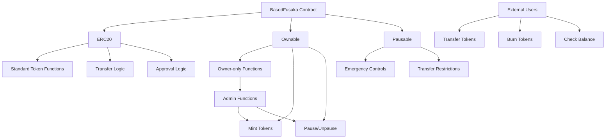
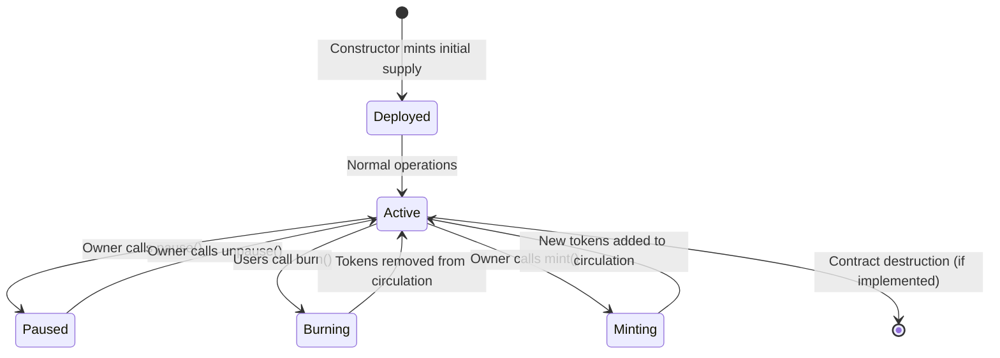

# BasedFusaka (BFK) Token

[](https://github.com/yourusername/BasedFusakaToken/actions)
[](https://opensource.org/licenses/MIT)
[](https://soliditylang.org/)
[](https://getfoundry.sh/)
[](https://base.org/)

A cutting edge ERC-20 token engineered for the Base ecosystem, combining institutional grade security with DeFi native flexibility. BasedFusaka empowers projects with seamless token management, emergency controls, and gas-optimized operations on Base's high-performance Layer 2 network.

## Table of Contents

- [Overview](#overview)
- [Deployments](#deployments)
- [Features](#features)
- [Architecture](#architecture)
- [Installation](#installation)
- [Usage](#usage)
- [Testing](#testing)
- [Deployment](#deployment)
- [Security](#security)
- [Contributing](#contributing)
- [License](#license)

## Overview

BasedFusaka (BFK) is a fully compliant ERC-20 token designed for the Base Blockchain  network. Built using OpenZeppelin's battle tested contracts and Foundry's modern development toolkit, this token provides a secure and efficient foundation for DeFi applications, governance systems, and utility tokens on Base.

The token implements essential ERC-20 functionality with additional administrative controls including minting, burning, and emergency pause mechanisms. It is optimized for gas efficiency and follows best practices for smart contract development.

## Deployments

BasedFusaka (BFK) is live on the Base network:

### Mainnet (Base)
- **Contract Address**: [0x6D347CFe8aBFf80067E87aA55776335b157790cF](https://basescan.org/address/0x6D347CFe8aBFf80067E87aA55776335b157790cF)
- **Block**: 40341849
- **Network**: Base (Chain ID: 8453)
- **Verification**: ✅ Verified on Basescan

### Testnet (Base Sepolia)
- **Contract Address**: [0x27E13AA6809D0C84429b97831d59C54a011F5eE1](https://sepolia.basescan.org/address/0x27E13AA6809D0C84429b97831d59C54a011F5eE1)
- **Block**: 35852325
- **Network**: Base Sepolia (Chain ID: 84532)
- **Verification**: ✅ Verified on Sepolia Basescan

**Token Details:**
- **Name**: BasedFusaka
- **Symbol**: BFK
- **Decimals**: 18
- **Initial Supply**: 1,000,000 BFK
- **Owner**: 0xC5983E0B551a7C60D62177CcCadf199b9EeAC54b

## Features

- **ERC-20 Compliance**: Full implementation of the ERC-20 standard
- **Owner Controls**: Minting and burning capabilities restricted to contract owner
- **Emergency Pause**: Circuit breaker functionality to halt all transfers in case of emergencies
- **Gas Optimized**: Custom errors and efficient implementation for reduced gas costs
- **Base Network Ready**: Configured for deployment on Base mainnet (Chain ID: 8453)
- **Comprehensive Testing**: Extensive test suite covering all functionality and edge cases

## Architecture

The BasedFusaka token architecture is built around three core OpenZeppelin contracts:



### Key Components

- **ERC20 Base**: Handles standard token operations (transfer, approve, transferFrom)
- **Ownable**: Restricts administrative functions to the contract owner
- **Pausable**: Allows emergency stopping of token transfers and approvals

### Token Lifecycle



## Installation

### Prerequisites

- [Foundry](https://getfoundry.sh/) - Ethereum development toolkit
- [Git](https://git-scm.com/) - Version control system

### Setup

1. Clone the repository:
```bash
git clone https://github.com/yourusername/BasedFusakaToken.git
cd BasedFusakaToken
```

2. Install dependencies:
```bash
forge install
```

3. Build the project:
```bash
forge build
```

## Usage

### Development Commands

Build contracts:
```bash
forge build
```

Run tests:
```bash
forge test
```

Format code:
```bash
forge fmt
```

Generate gas snapshots:
```bash
forge snapshot
```

### Local Development Node

Start a local Ethereum node:
```bash
anvil
```

### Contract Interaction

Use Cast for contract interactions:
```bash
cast <subcommand>
```

## Testing

The project includes a comprehensive test suite covering:

- Token deployment and initialization
- Minting functionality (owner-only)
- Burning functionality (any user)
- Transfer restrictions during pause
- Emergency pause/unpause controls
- Edge cases and error handling

Run the full test suite:
```bash
forge test
```

Run tests with gas reporting:
```bash
forge test --gas-report
```

Run specific test file:
```bash
forge test --match-path test/BasedFusaka.t.sol
```

## Deployment

### Testnet Deployment

Deploy to Base Sepolia testnet:
```bash
forge script script/DeployBase.s.sol:DeployBase --rpc-url $BASE_SEPOLIA_RPC_URL --private-key $PRIVATE_KEY --broadcast --verify
```

### Mainnet Deployment

Deploy to Base mainnet:
```bash
forge script script/DeployBase.s.sol:DeployBase --rpc-url $BASE_MAINNET_RPC_URL --private-key $PRIVATE_KEY --broadcast --verify
```

### Verification

Verify contract on Basescan:
```bash
forge script script/VerifyBaseScan.s.sol:VerifyBaseScan --rpc-url $BASE_RPC_URL --private-key $PRIVATE_KEY --broadcast
```

## Security

This contract has been designed with security as a primary consideration:

- Uses OpenZeppelin's audited contracts
- Implements checks-effects-interactions pattern
- Custom errors for gas efficiency
- Emergency pause functionality
- Owner-only administrative functions

### Audit Status

The contract is based on OpenZeppelin's thoroughly audited codebase. For production use, consider a professional security audit.

## Contributing

We welcome contributions to improve the BasedFusaka token. Please follow these steps:

1. Fork the repository
2. Create a feature branch: `git checkout -b feature/your-feature`
3. Make your changes and add tests
4. Ensure all tests pass: `forge test`
5. Format your code: `forge fmt`
6. Submit a pull request

### Development Guidelines

- Follow Solidity style guide
- Write comprehensive tests for new features
- Update documentation for API changes
- Ensure gas efficiency in optimizations

## License

This project is licensed under the MIT License - see the [LICENSE](LICENSE) file for details.

---

Built with [Foundry](https://getfoundry.sh/) and [OpenZeppelin Contracts](https://openzeppelin.com/contracts/).
